# Build a SQL assistant with on-demand skills

This tutorial shows how to use **progressive disclosure** - a context management technique where the agent loads information on-demand rather than upfront - to implement **skills** (specialized prompt-based instructions). The agent loads skills via tool calls, rather than dynamically changing the system prompt, discovering and loading only the skills it needs for each task.

**Use case:** Imagine building an agent to help write SQL queries across different business verticals in a large enterprise. Your organization might have separate datastores for each vertical, or a single monolithic database with thousands of tables. Either way, loading all schemas upfront would overwhelm the context window. Progressive disclosure solves this by loading only the relevant schema when needed. This architecture also enables different product owners and stakeholders to independently contribute and maintain skills for their specific business verticals.

**What you'll build:** A SQL query assistant with two skills (sales analytics and inventory management). The agent sees lightweight skill descriptions in its system prompt, then loads full database schemas and business logic through tool calls only when relevant to the user's query.

<Note>
  For a more complete example of a SQL agent with query execution, error correction, and validation, see our [SQL Agent tutorial](/oss/python/langchain/sql-agent). This tutorial focuses on the progressive disclosure pattern which can be applied to any domain.
</Note>

<Tip>
  Progressive disclosure was popularized by Anthropic as a technique for building scalable agent skills systems. This approach uses a three-level architecture (metadata → core content → detailed resources) where agents load information only as needed. For more on this technique, see [Equipping agents for the real world with Agent Skills](https://www.anthropic.com/engineering/equipping-agents-for-the-real-world-with-agent-skills).
</Tip>

## How it works

Here's the flow when a user asks for a SQL query:

```mermaid  theme={null}
%%{init: {'theme':'base', 'themeVariables': { 'primaryColor':'#4CAF50','primaryTextColor':'#fff','primaryBorderColor':'#2E7D32','lineColor':'#666','secondaryColor':'#FF9800','tertiaryColor':'#2196F3','tertiaryBorderColor':'#1565C0','tertiaryTextColor':'#fff'}}}%%
flowchart TD
    Start([💬 User: Write SQL query<br/>for high-value customers]) --> SystemPrompt[📋 Agent sees skill descriptions:<br/>• sales_analytics<br/>• inventory_management]

    SystemPrompt --> Decide{🤔 Need sales schema}

    Decide --> LoadSkill[🔧 load_skill<br/>'sales_analytics']

    LoadSkill --> Schema[📊 Schema loaded:<br/>customers, orders tables<br/>+ business logic]

    Schema --> WriteQuery[✍️ Agent writes SQL query<br/>using schema knowledge]

    WriteQuery --> Response([✅ Returns valid SQL<br/>following business rules])

    %% Styling for light and dark modes
    classDef startEnd fill:#4CAF50,stroke:#2E7D32,stroke-width:2px,color:#fff
    classDef process fill:#FF9800,stroke:#E65100,stroke-width:2px,color:#fff
    classDef decision fill:#2196F3,stroke:#1565C0,stroke-width:2px,color:#fff
    classDef enrichment fill:#9C27B0,stroke:#6A1B9A,stroke-width:2px,color:#fff

    class Start,Response startEnd
    class SystemPrompt,LoadSkill,WriteQuery process
    class Decide decision
    class Schema enrichment
```



**Why progressive disclosure:**

* **Reduces context usage** - load only the 2-3 skills needed for a task, not all available skills
* **Enables team autonomy** - different teams can develop specialized skills independently (similar to other multi-agent architectures)
* **Scales efficiently** - add dozens or hundreds of skills without overwhelming context
* **Simplifies conversation history** - single agent with one conversation thread

**What are skills:** Skills, as popularized by Claude Code, are primarily prompt-based: self-contained units of specialized instructions for specific business tasks. In Claude Code, skills are exposed as directories with files on the file system, discovered through file operations. Skills guide behavior through prompts and can provide information about tool usage or include sample code for a coding agent to execute.

<Tip>
  Skills with progressive disclosure can be viewed as a form of [RAG (Retrieval-Augmented Generation)](/oss/python/langchain/rag), where each skill is a retrieval unit—though not necessarily backed by embeddings or keyword search, but by tools for browsing content (like file operations or, in this tutorial, direct lookup).
</Tip>

**Trade-offs:**

* **Latency**: Loading skills on-demand requires additional tool calls, which adds latency to the first request that needs each skill
* **Workflow control**: Basic implementations rely on prompting to guide skill usage - you cannot enforce hard constraints like "always try skill A before skill B" without custom logic

<Tip>
  **Implementing your own skills system**

  When building your own skills implementation (as we do in this tutorial), the core concept is progressive disclosure - loading information on-demand. Beyond that, you have full flexibility in implementation:

  * **Storage**: databases, S3, in-memory data structures, or any backend
  * **Discovery**: direct lookup (this tutorial), RAG for large skill collections, file system scanning, or API calls
  * **Loading logic**: customize latency characteristics and add logic to search through skill content or rank relevance
  * **Side effects**: define what happens when a skill loads, such as exposing tools associated with that skill (covered in section 8)

  This flexibility lets you optimize for your specific requirements around performance, storage, and workflow control.
</Tip>

## Setup

### Installation

This tutorial requires the `langchain` package:

<CodeGroup>
  ```bash pip theme={null}
  pip install langchain
  ```

  ```bash uv theme={null}
  uv add langchain
  ```

  ```bash conda theme={null}
  conda install langchain -c conda-forge
  ```
</CodeGroup>

For more details, see our [Installation guide](/oss/python/langchain/install).

### LangSmith

Set up [LangSmith](https://smith.langchain.com) to inspect what is happening inside your agent. Then set the following environment variables:

<CodeGroup>
  ```bash bash theme={null}
  export LANGSMITH_TRACING="true"
  export LANGSMITH_API_KEY="..."
  ```

  ```python python theme={null}
  import getpass
  import os

  os.environ["LANGSMITH_TRACING"] = "true"
  os.environ["LANGSMITH_API_KEY"] = getpass.getpass()
  ```
</CodeGroup>

### Select an LLM

Select a chat model from LangChain's suite of integrations:

<Tabs>
  <Tab title="OpenAI">
    👉 Read the [OpenAI chat model integration docs](/oss/python/integrations/chat/openai/)

    ```shell  theme={null}
    pip install -U "langchain[openai]"
    ```

    <CodeGroup>
      ```python init_chat_model theme={null}
      import os
      from langchain.chat_models import init_chat_model

      os.environ["OPENAI_API_KEY"] = "sk-..."

      model = init_chat_model("gpt-4.1")
      ```

      ```python Model Class theme={null}
      import os
      from langchain_openai import ChatOpenAI

      os.environ["OPENAI_API_KEY"] = "sk-..."

      model = ChatOpenAI(model="gpt-4.1")
      ```
    </CodeGroup>
  </Tab>

  <Tab title="Anthropic">
    👉 Read the [Anthropic chat model integration docs](/oss/python/integrations/chat/anthropic/)

    ```shell  theme={null}
    pip install -U "langchain[anthropic]"
    ```

    <CodeGroup>
      ```python init_chat_model theme={null}
      import os
      from langchain.chat_models import init_chat_model

      os.environ["ANTHROPIC_API_KEY"] = "sk-..."

      model = init_chat_model("claude-sonnet-4-5-20250929")
      ```

      ```python Model Class theme={null}
      import os
      from langchain_anthropic import ChatAnthropic

      os.environ["ANTHROPIC_API_KEY"] = "sk-..."

      model = ChatAnthropic(model="claude-sonnet-4-5-20250929")
      ```
    </CodeGroup>
  </Tab>

  <Tab title="Azure">
    👉 Read the [Azure chat model integration docs](/oss/python/integrations/chat/azure_chat_openai/)

    ```shell  theme={null}
    pip install -U "langchain[openai]"
    ```

    <CodeGroup>
      ```python init_chat_model theme={null}
      import os
      from langchain.chat_models import init_chat_model

      os.environ["AZURE_OPENAI_API_KEY"] = "..."
      os.environ["AZURE_OPENAI_ENDPOINT"] = "..."
      os.environ["OPENAI_API_VERSION"] = "2025-03-01-preview"

      model = init_chat_model(
          "azure_openai:gpt-4.1",
          azure_deployment=os.environ["AZURE_OPENAI_DEPLOYMENT_NAME"],
      )
      ```

      ```python Model Class theme={null}
      import os
      from langchain_openai import AzureChatOpenAI

      os.environ["AZURE_OPENAI_API_KEY"] = "..."
      os.environ["AZURE_OPENAI_ENDPOINT"] = "..."
      os.environ["OPENAI_API_VERSION"] = "2025-03-01-preview"

      model = AzureChatOpenAI(
          model="gpt-4.1",
          azure_deployment=os.environ["AZURE_OPENAI_DEPLOYMENT_NAME"]
      )
      ```
    </CodeGroup>
  </Tab>

  <Tab title="Google Gemini">
    👉 Read the [Google GenAI chat model integration docs](/oss/python/integrations/chat/google_generative_ai/)

    ```shell  theme={null}
    pip install -U "langchain[google-genai]"
    ```

    <CodeGroup>
      ```python init_chat_model theme={null}
      import os
      from langchain.chat_models import init_chat_model

      os.environ["GOOGLE_API_KEY"] = "..."

      model = init_chat_model("google_genai:gemini-2.5-flash-lite")
      ```

      ```python Model Class theme={null}
      import os
      from langchain_google_genai import ChatGoogleGenerativeAI

      os.environ["GOOGLE_API_KEY"] = "..."

      model = ChatGoogleGenerativeAI(model="gemini-2.5-flash-lite")
      ```
    </CodeGroup>
  </Tab>

  <Tab title="AWS Bedrock">
    👉 Read the [AWS Bedrock chat model integration docs](/oss/python/integrations/chat/bedrock/)

    ```shell  theme={null}
    pip install -U "langchain[aws]"
    ```

    <CodeGroup>
      ```python init_chat_model theme={null}
      from langchain.chat_models import init_chat_model

      # Follow the steps here to configure your credentials:
      # https://docs.aws.amazon.com/bedrock/latest/userguide/getting-started.html

      model = init_chat_model(
          "anthropic.claude-3-5-sonnet-20240620-v1:0",
          model_provider="bedrock_converse",
      )
      ```

      ```python Model Class theme={null}
      from langchain_aws import ChatBedrock

      model = ChatBedrock(model="anthropic.claude-3-5-sonnet-20240620-v1:0")
      ```
    </CodeGroup>
  </Tab>

  <Tab title="HuggingFace">
    👉 Read the [HuggingFace chat model integration docs](/oss/python/integrations/chat/huggingface/)

    ```shell  theme={null}
    pip install -U "langchain[huggingface]"
    ```

    <CodeGroup>
      ```python init_chat_model theme={null}
      import os
      from langchain.chat_models import init_chat_model

      os.environ["HUGGINGFACEHUB_API_TOKEN"] = "hf_..."

      model = init_chat_model(
          "microsoft/Phi-3-mini-4k-instruct",
          model_provider="huggingface",
          temperature=0.7,
          max_tokens=1024,
      )
      ```

      ```python Model Class theme={null}
      import os
      from langchain_huggingface import ChatHuggingFace, HuggingFaceEndpoint

      os.environ["HUGGINGFACEHUB_API_TOKEN"] = "hf_..."

      llm = HuggingFaceEndpoint(
          repo_id="microsoft/Phi-3-mini-4k-instruct",
          temperature=0.7,
          max_length=1024,
      )
      model = ChatHuggingFace(llm=llm)
      ```
    </CodeGroup>
  </Tab>
</Tabs>

## 1. Define skills

First, define the structure for skills. Each skill has a name, a brief description (shown in the system prompt), and full content (loaded on-demand):

```python  theme={null}
from typing import TypedDict

class Skill(TypedDict):  # [!code highlight]
    """A skill that can be progressively disclosed to the agent."""
    name: str  # Unique identifier for the skill
    description: str  # 1-2 sentence description to show in system prompt
    content: str  # Full skill content with detailed instructions
```

Now define example skills for a SQL query assistant. The skills are designed to be **lightweight in description** (shown to the agent upfront) but **detailed in content** (loaded only when needed):

<Accordion title="View complete skill definitions">
  ```python  theme={null}
  SKILLS: list[Skill] = [
      {
          "name": "sales_analytics",
          "description": "Database schema and business logic for sales data analysis including customers, orders, and revenue.",
          "content": """# Sales Analytics Schema

  ## Tables

  ### customers
  - customer_id (PRIMARY KEY)
  - name
  - email
  - signup_date
  - status (active/inactive)
  - customer_tier (bronze/silver/gold/platinum)

  ### orders
  - order_id (PRIMARY KEY)
  - customer_id (FOREIGN KEY -> customers)
  - order_date
  - status (pending/completed/cancelled/refunded)
  - total_amount
  - sales_region (north/south/east/west)

  ### order_items
  - item_id (PRIMARY KEY)
  - order_id (FOREIGN KEY -> orders)
  - product_id
  - quantity
  - unit_price
  - discount_percent

  ## Business Logic

  **Active customers**: status = 'active' AND signup_date <= CURRENT_DATE - INTERVAL '90 days'

  **Revenue calculation**: Only count orders with status = 'completed'. Use total_amount from orders table, which already accounts for discounts.

  **Customer lifetime value (CLV)**: Sum of all completed order amounts for a customer.

  **High-value orders**: Orders with total_amount > 1000

  ## Example Query

  -- Get top 10 customers by revenue in the last quarter
  SELECT
      c.customer_id,
      c.name,
      c.customer_tier,
      SUM(o.total_amount) as total_revenue
  FROM customers c
  JOIN orders o ON c.customer_id = o.customer_id
  WHERE o.status = 'completed'
    AND o.order_date >= CURRENT_DATE - INTERVAL '3 months'
  GROUP BY c.customer_id, c.name, c.customer_tier
  ORDER BY total_revenue DESC
  LIMIT 10;
  """,
      },
      {
          "name": "inventory_management",
          "description": "Database schema and business logic for inventory tracking including products, warehouses, and stock levels.",
          "content": """# Inventory Management Schema

  ## Tables

  ### products
  - product_id (PRIMARY KEY)
  - product_name
  - sku
  - category
  - unit_cost
  - reorder_point (minimum stock level before reordering)
  - discontinued (boolean)

  ### warehouses
  - warehouse_id (PRIMARY KEY)
  - warehouse_name
  - location
  - capacity

  ### inventory
  - inventory_id (PRIMARY KEY)
  - product_id (FOREIGN KEY -> products)
  - warehouse_id (FOREIGN KEY -> warehouses)
  - quantity_on_hand
  - last_updated

  ### stock_movements
  - movement_id (PRIMARY KEY)
  - product_id (FOREIGN KEY -> products)
  - warehouse_id (FOREIGN KEY -> warehouses)
  - movement_type (inbound/outbound/transfer/adjustment)
  - quantity (positive for inbound, negative for outbound)
  - movement_date
  - reference_number

  ## Business Logic

  **Available stock**: quantity_on_hand from inventory table where quantity_on_hand > 0

  **Products needing reorder**: Products where total quantity_on_hand across all warehouses is less than or equal to the product's reorder_point

  **Active products only**: Exclude products where discontinued = true unless specifically analyzing discontinued items

  **Stock valuation**: quantity_on_hand * unit_cost for each product

  ## Example Query

  -- Find products below reorder point across all warehouses
  SELECT
      p.product_id,
      p.product_name,
      p.reorder_point,
      SUM(i.quantity_on_hand) as total_stock,
      p.unit_cost,
      (p.reorder_point - SUM(i.quantity_on_hand)) as units_to_reorder
  FROM products p
  JOIN inventory i ON p.product_id = i.product_id
  WHERE p.discontinued = false
  GROUP BY p.product_id, p.product_name, p.reorder_point, p.unit_cost
  HAVING SUM(i.quantity_on_hand) <= p.reorder_point
  ORDER BY units_to_reorder DESC;
  """,
      },
  ]
  ```
</Accordion>

## 2. Create skill loading tool

Create a tool to load full skill content on-demand:

```python  theme={null}
from langchain.tools import tool

@tool  # [!code highlight]
def load_skill(skill_name: str) -> str:
    """Load the full content of a skill into the agent's context.

    Use this when you need detailed information about how to handle a specific
    type of request. This will provide you with comprehensive instructions,
    policies, and guidelines for the skill area.

    Args:
        skill_name: The name of the skill to load (e.g., "expense_reporting", "travel_booking")
    """
    # Find and return the requested skill
    for skill in SKILLS:
        if skill["name"] == skill_name:
            return f"Loaded skill: {skill_name}\n\n{skill['content']}"  # [!code highlight]

    # Skill not found
    available = ", ".join(s["name"] for s in SKILLS)
    return f"Skill '{skill_name}' not found. Available skills: {available}"
```

The `load_skill` tool returns the full skill content as a string, which becomes part of the conversation as a ToolMessage. For more details on creating and using tools, see the [Tools guide](/oss/python/langchain/tools).

## 3. Build skill middleware

Create custom middleware that injects skill descriptions into the system prompt. This middleware makes skills discoverable without loading their full content upfront.

<Note>
  This guide demonstrates creating custom middleware. For a comprehensive guide on middleware concepts and patterns, see the [custom middleware documentation](/oss/python/langchain/middleware/custom).
</Note>

```python  theme={null}
from langchain.agents.middleware import ModelRequest, ModelResponse, AgentMiddleware
from langchain.messages import SystemMessage
from typing import Callable

class SkillMiddleware(AgentMiddleware):  # [!code highlight]
    """Middleware that injects skill descriptions into the system prompt."""

    # Register the load_skill tool as a class variable
    tools = [load_skill]  # [!code highlight]

    def __init__(self):
        """Initialize and generate the skills prompt from SKILLS."""
        # Build skills prompt from the SKILLS list
        skills_list = []
        for skill in SKILLS:
            skills_list.append(
                f"- **{skill['name']}**: {skill['description']}"
            )
        self.skills_prompt = "\n".join(skills_list)

    def wrap_model_call(
        self,
        request: ModelRequest,
        handler: Callable[[ModelRequest], ModelResponse],
    ) -> ModelResponse:
        """Sync: Inject skill descriptions into system prompt."""
        # Build the skills addendum
        skills_addendum = ( # [!code highlight]
            f"\n\n## Available Skills\n\n{self.skills_prompt}\n\n" # [!code highlight]
            "Use the load_skill tool when you need detailed information " # [!code highlight]
            "about handling a specific type of request." # [!code highlight]
        )

        # Append to system message content blocks
        new_content = list(request.system_message.content_blocks) + [
            {"type": "text", "text": skills_addendum}
        ]
        new_system_message = SystemMessage(content=new_content)
        modified_request = request.override(system_message=new_system_message)
        return handler(modified_request)
```

The middleware appends skill descriptions to the system prompt, making the agent aware of available skills without loading their full content. The `load_skill` tool is registered as a class variable, making it available to the agent.

<Note>
  **Production consideration**: This tutorial loads the skill list in `__init__` for simplicity. In a production system, you may want to load skills in the `before_agent` hook instead, allowing them to be refreshed periodically to reflect up-to-date changes (e.g., when new skills are added or existing ones are modified). See the [before\_agent hook documentation](/oss/python/langchain/middleware/custom#before_agent) for details.
</Note>

## 4. Create the agent with skill support

Now create the agent with the skill middleware and a checkpointer for state persistence:

```python  theme={null}
from langchain.agents import create_agent
from langgraph.checkpoint.memory import InMemorySaver

# Create the agent with skill support
agent = create_agent(
    model,
    system_prompt=(
        "You are a SQL query assistant that helps users "
        "write queries against business databases."
    ),
    middleware=[SkillMiddleware()],  # [!code highlight]
    checkpointer=InMemorySaver(),
)
```

The agent now has access to skill descriptions in its system prompt and can call `load_skill` to retrieve full skill content when needed. The checkpointer maintains conversation history across turns.

## 5. Test progressive disclosure

Test the agent with a question that requires skill-specific knowledge:

```python  theme={null}
import uuid

# Configuration for this conversation thread
thread_id = str(uuid.uuid4())
config = {"configurable": {"thread_id": thread_id}}

# Ask for a SQL query
result = agent.invoke(  # [!code highlight]
    {
        "messages": [
            {
                "role": "user",
                "content": (
                    "Write a SQL query to find all customers "
                    "who made orders over $1000 in the last month"
                ),
            }
        ]
    },
    config
)

# Print the conversation
for message in result["messages"]:
    if hasattr(message, 'pretty_print'):
        message.pretty_print()
    else:
        print(f"{message.type}: {message.content}")
```

Expected output:

```
================================ Human Message =================================

Write a SQL query to find all customers who made orders over $1000 in the last month
================================== Ai Message ==================================
Tool Calls:
  load_skill (call_abc123)
 Call ID: call_abc123
  Args:
    skill_name: sales_analytics
================================= Tool Message =================================
Name: load_skill

Loaded skill: sales_analytics

# Sales Analytics Schema

## Tables

### customers
- customer_id (PRIMARY KEY)
- name
- email
- signup_date
- status (active/inactive)
- customer_tier (bronze/silver/gold/platinum)

### orders
- order_id (PRIMARY KEY)
- customer_id (FOREIGN KEY -> customers)
- order_date
- status (pending/completed/cancelled/refunded)
- total_amount
- sales_region (north/south/east/west)

[... rest of schema ...]

## Business Logic

**High-value orders**: Orders with `total_amount > 1000`
**Revenue calculation**: Only count orders with `status = 'completed'`

================================== Ai Message ==================================

Here's a SQL query to find all customers who made orders over $1000 in the last month:

\`\`\`sql
SELECT DISTINCT
    c.customer_id,
    c.name,
    c.email,
    c.customer_tier
FROM customers c
JOIN orders o ON c.customer_id = o.customer_id
WHERE o.total_amount > 1000
  AND o.status = 'completed'
  AND o.order_date >= CURRENT_DATE - INTERVAL '1 month'
ORDER BY c.customer_id;
\`\`\`

This query:
- Joins customers with their orders
- Filters for high-value orders (>$1000) using the total_amount field
- Only includes completed orders (as per the business logic)
- Restricts to orders from the last month
- Returns distinct customers to avoid duplicates if they made multiple qualifying orders
```

The agent saw the lightweight skill description in its system prompt, recognized the question required sales database knowledge, called `load_skill("sales_analytics")` to get the full schema and business logic, and then used that information to write a correct query following the database conventions.

## 6. Advanced: Add constraints with custom state

<Accordion title="Optional: Track loaded skills and enforce tool constraints">
  You can add constraints to enforce that certain tools are only available after specific skills have been loaded. This requires tracking which skills have been loaded in custom agent state.

  ### Define custom state

  First, extend the agent state to track loaded skills:

  ```python  theme={null}
  from langchain.agents.middleware import AgentState

  class CustomState(AgentState):  # [!code highlight]
      skills_loaded: NotRequired[list[str]]  # Track which skills have been loaded  # [!code highlight]
  ```

  ### Update load\_skill to modify state

  Modify the `load_skill` tool to update state when a skill is loaded:

  ```python  theme={null}
  from langgraph.types import Command  # [!code highlight]
  from langchain.tools import tool, ToolRuntime
  from langchain.messages import ToolMessage  # [!code highlight]

  @tool
  def load_skill(skill_name: str, runtime: ToolRuntime) -> Command:  # [!code highlight]
      """Load the full content of a skill into the agent's context.

      Use this when you need detailed information about how to handle a specific
      type of request. This will provide you with comprehensive instructions,
      policies, and guidelines for the skill area.

      Args:
          skill_name: The name of the skill to load
      """
      # Find and return the requested skill
      for skill in SKILLS:
          if skill["name"] == skill_name:
              skill_content = f"Loaded skill: {skill_name}\n\n{skill['content']}"

              # Update state to track loaded skill
              return Command(  # [!code highlight]
                  update={  # [!code highlight]
                      "messages": [  # [!code highlight]
                          ToolMessage(  # [!code highlight]
                              content=skill_content,  # [!code highlight]
                              tool_call_id=runtime.tool_call_id,  # [!code highlight]
                          )  # [!code highlight]
                      ],  # [!code highlight]
                      "skills_loaded": [skill_name],  # [!code highlight]
                  }  # [!code highlight]
              )  # [!code highlight]

      # Skill not found
      available = ", ".join(s["name"] for s in SKILLS)
      return Command(
          update={
              "messages": [
                  ToolMessage(
                      content=f"Skill '{skill_name}' not found. Available skills: {available}",
                      tool_call_id=runtime.tool_call_id,
                  )
              ]
          }
      )
  ```

  ### Create constrained tool

  Create a tool that's only usable after a specific skill has been loaded:

  ````python  theme={null}
  @tool
  def write_sql_query(  # [!code highlight]
      query: str,
      vertical: str,
      runtime: ToolRuntime,
  ) -> str:
      """Write and validate a SQL query for a specific business vertical.

      This tool helps format and validate SQL queries. You must load the
      appropriate skill first to understand the database schema.

      Args:
          query: The SQL query to write
          vertical: The business vertical (sales_analytics or inventory_management)
      """
      # Check if the required skill has been loaded
      skills_loaded = runtime.state.get("skills_loaded", [])  # [!code highlight]

      if vertical not in skills_loaded:  # [!code highlight]
          return (  # [!code highlight]
              f"Error: You must load the '{vertical}' skill first "  # [!code highlight]
              f"to understand the database schema before writing queries. "  # [!code highlight]
              f"Use load_skill('{vertical}') to load the schema."  # [!code highlight]
          )  # [!code highlight]

      # Validate and format the query
      return (
          f"SQL Query for {vertical}:\n\n"
          f"```sql\n{query}\n```\n\n"
          f"✓ Query validated against {vertical} schema\n"
          f"Ready to execute against the database."
      )
  ````

  ### Update middleware and agent

  Update the middleware to use the custom state schema:

  ```python  theme={null}
  class SkillMiddleware(AgentMiddleware[CustomState]):  # [!code highlight]
      """Middleware that injects skill descriptions into the system prompt."""

      state_schema = CustomState  # [!code highlight]
      tools = [load_skill, write_sql_query]  # [!code highlight]

      # ... rest of the middleware implementation stays the same
  ```

  Create the agent with the middleware that registers the constrained tool:

  ```python  theme={null}
  agent = create_agent(
      model,
      system_prompt=(
          "You are a SQL query assistant that helps users "
          "write queries against business databases."
      ),
      middleware=[SkillMiddleware()],  # [!code highlight]
      checkpointer=InMemorySaver(),
  )
  ```

  Now if the agent tries to use `write_sql_query` before loading the required skill, it will receive an error message prompting it to load the appropriate skill (e.g., `sales_analytics` or `inventory_management`) first. This ensures the agent has the necessary schema knowledge before attempting to validate queries.
</Accordion>

## Complete example

<Accordion title="View complete runnable script">
  Here's a complete, runnable implementation combining all the pieces from this tutorial:

  ```python  theme={null}
  import uuid
  from typing import TypedDict, NotRequired
  from langchain.tools import tool
  from langchain.agents import create_agent
  from langchain.agents.middleware import ModelRequest, ModelResponse, AgentMiddleware
  from langchain.messages import SystemMessage
  from langgraph.checkpoint.memory import InMemorySaver
  from typing import Callable

  # Define skill structure
  class Skill(TypedDict):
      """A skill that can be progressively disclosed to the agent."""
      name: str
      description: str
      content: str

  # Define skills with schemas and business logic
  SKILLS: list[Skill] = [
      {
          "name": "sales_analytics",
          "description": "Database schema and business logic for sales data analysis including customers, orders, and revenue.",
          "content": """# Sales Analytics Schema

  ## Tables

  ### customers
  - customer_id (PRIMARY KEY)
  - name
  - email
  - signup_date
  - status (active/inactive)
  - customer_tier (bronze/silver/gold/platinum)

  ### orders
  - order_id (PRIMARY KEY)
  - customer_id (FOREIGN KEY -> customers)
  - order_date
  - status (pending/completed/cancelled/refunded)
  - total_amount
  - sales_region (north/south/east/west)

  ### order_items
  - item_id (PRIMARY KEY)
  - order_id (FOREIGN KEY -> orders)
  - product_id
  - quantity
  - unit_price
  - discount_percent

  ## Business Logic

  **Active customers**: status = 'active' AND signup_date <= CURRENT_DATE - INTERVAL '90 days'

  **Revenue calculation**: Only count orders with status = 'completed'. Use total_amount from orders table, which already accounts for discounts.

  **Customer lifetime value (CLV)**: Sum of all completed order amounts for a customer.

  **High-value orders**: Orders with total_amount > 1000

  ## Example Query

  -- Get top 10 customers by revenue in the last quarter
  SELECT
      c.customer_id,
      c.name,
      c.customer_tier,
      SUM(o.total_amount) as total_revenue
  FROM customers c
  JOIN orders o ON c.customer_id = o.customer_id
  WHERE o.status = 'completed'
    AND o.order_date >= CURRENT_DATE - INTERVAL '3 months'
  GROUP BY c.customer_id, c.name, c.customer_tier
  ORDER BY total_revenue DESC
  LIMIT 10;
  """,
      },
      {
          "name": "inventory_management",
          "description": "Database schema and business logic for inventory tracking including products, warehouses, and stock levels.",
          "content": """# Inventory Management Schema

  ## Tables

  ### products
  - product_id (PRIMARY KEY)
  - product_name
  - sku
  - category
  - unit_cost
  - reorder_point (minimum stock level before reordering)
  - discontinued (boolean)

  ### warehouses
  - warehouse_id (PRIMARY KEY)
  - warehouse_name
  - location
  - capacity

  ### inventory
  - inventory_id (PRIMARY KEY)
  - product_id (FOREIGN KEY -> products)
  - warehouse_id (FOREIGN KEY -> warehouses)
  - quantity_on_hand
  - last_updated

  ### stock_movements
  - movement_id (PRIMARY KEY)
  - product_id (FOREIGN KEY -> products)
  - warehouse_id (FOREIGN KEY -> warehouses)
  - movement_type (inbound/outbound/transfer/adjustment)
  - quantity (positive for inbound, negative for outbound)
  - movement_date
  - reference_number

  ## Business Logic

  **Available stock**: quantity_on_hand from inventory table where quantity_on_hand > 0

  **Products needing reorder**: Products where total quantity_on_hand across all warehouses is less than or equal to the product's reorder_point

  **Active products only**: Exclude products where discontinued = true unless specifically analyzing discontinued items

  **Stock valuation**: quantity_on_hand * unit_cost for each product

  ## Example Query

  -- Find products below reorder point across all warehouses
  SELECT
      p.product_id,
      p.product_name,
      p.reorder_point,
      SUM(i.quantity_on_hand) as total_stock,
      p.unit_cost,
      (p.reorder_point - SUM(i.quantity_on_hand)) as units_to_reorder
  FROM products p
  JOIN inventory i ON p.product_id = i.product_id
  WHERE p.discontinued = false
  GROUP BY p.product_id, p.product_name, p.reorder_point, p.unit_cost
  HAVING SUM(i.quantity_on_hand) <= p.reorder_point
  ORDER BY units_to_reorder DESC;
  """,
      },
  ]

  # Create skill loading tool
  @tool
  def load_skill(skill_name: str) -> str:
      """Load the full content of a skill into the agent's context.

      Use this when you need detailed information about how to handle a specific
      type of request. This will provide you with comprehensive instructions,
      policies, and guidelines for the skill area.

      Args:
          skill_name: The name of the skill to load (e.g., "sales_analytics", "inventory_management")
      """
      # Find and return the requested skill
      for skill in SKILLS:
          if skill["name"] == skill_name:
              return f"Loaded skill: {skill_name}\n\n{skill['content']}"

      # Skill not found
      available = ", ".join(s["name"] for s in SKILLS)
      return f"Skill '{skill_name}' not found. Available skills: {available}"

  # Create skill middleware
  class SkillMiddleware(AgentMiddleware):
      """Middleware that injects skill descriptions into the system prompt."""

      # Register the load_skill tool as a class variable
      tools = [load_skill]

      def __init__(self):
          """Initialize and generate the skills prompt from SKILLS."""
          # Build skills prompt from the SKILLS list
          skills_list = []
          for skill in SKILLS:
              skills_list.append(
                  f"- **{skill['name']}**: {skill['description']}"
              )
          self.skills_prompt = "\n".join(skills_list)

      def wrap_model_call(
          self,
          request: ModelRequest,
          handler: Callable[[ModelRequest], ModelResponse],
      ) -> ModelResponse:
          """Sync: Inject skill descriptions into system prompt."""
          # Build the skills addendum
          skills_addendum = (
              f"\n\n## Available Skills\n\n{self.skills_prompt}\n\n"
              "Use the load_skill tool when you need detailed information "
              "about handling a specific type of request."
          )

          # Append to system message content blocks
          new_content = list(request.system_message.content_blocks) + [
              {"type": "text", "text": skills_addendum}
          ]
          new_system_message = SystemMessage(content=new_content)
          modified_request = request.override(system_message=new_system_message)
          return handler(modified_request)

  # Initialize your chat model (replace with your model)
  # Example: from langchain_anthropic import ChatAnthropic
  # model = ChatAnthropic(model="claude-3-5-sonnet-20241022")
  from langchain_openai import ChatOpenAI
  model = ChatOpenAI(model="gpt-4")

  # Create the agent with skill support
  agent = create_agent(
      model,
      system_prompt=(
          "You are a SQL query assistant that helps users "
          "write queries against business databases."
      ),
      middleware=[SkillMiddleware()],
      checkpointer=InMemorySaver(),
  )

  # Example usage
  if __name__ == "__main__":
      # Configuration for this conversation thread
      thread_id = str(uuid.uuid4())
      config = {"configurable": {"thread_id": thread_id}}

      # Ask for a SQL query
      result = agent.invoke(
          {
              "messages": [
                  {
                      "role": "user",
                      "content": (
                          "Write a SQL query to find all customers "
                          "who made orders over $1000 in the last month"
                      ),
                  }
              ]
          },
          config
      )

      # Print the conversation
      for message in result["messages"]:
          if hasattr(message, 'pretty_print'):
              message.pretty_print()
          else:
              print(f"{message.type}: {message.content}")
  ```

  This complete example includes:

  * Skill definitions with full database schemas
  * The `load_skill` tool for on-demand loading
  * `SkillMiddleware` that injects skill descriptions into the system prompt
  * Agent creation with middleware and checkpointer
  * Example usage showing how the agent loads skills and writes SQL queries

  To run this, you'll need to:

  1. Install required packages: `pip install langchain langchain-openai langgraph`
  2. Set your API key (e.g., `export OPENAI_API_KEY=...`)
  3. Replace the model initialization with your preferred LLM provider
</Accordion>

## Implementation variations

<Accordion title="View implementation options and trade-offs">
  This tutorial implemented skills as in-memory Python dictionaries loaded through tool calls. However, there are several ways to implement progressive disclosure with skills:

  **Storage backends:**

  * **In-memory** (this tutorial): Skills defined as Python data structures, fast access, no I/O overhead
  * **File system** (Claude Code approach): Skills as directories with files, discovered via file operations like `read_file`
  * **Remote storage**: Skills in S3, databases, Notion, or APIs, fetched on-demand

  **Skill discovery** (how the agent learns which skills exist):

  * **System prompt listing**: Skill descriptions in system prompt (used in this tutorial)
  * **File-based**: Discover skills by scanning directories (Claude Code approach)
  * **Registry-based**: Query a skill registry service or API for available skills
  * **Dynamic lookup**: List available skills via a tool call

  **Progressive disclosure strategies** (how skill content is loaded):

  * **Single load**: Load entire skill content in one tool call (used in this tutorial)
  * **Paginated**: Load skill content in multiple pages/chunks for large skills
  * **Search-based**: Search within a specific skill's content for relevant sections (e.g., using grep/read operations on skill files)
  * **Hierarchical**: Load skill overview first, then drill into specific subsections

  **Size considerations** (uncalibrated mental model - optimize for your system):

  * **Small skills** (\< 1K tokens / \~750 words): Can be included directly in system prompt and cached with prompt caching for cost savings and faster responses
  * **Medium skills** (1-10K tokens / \~750-7.5K words): Benefit from on-demand loading to avoid context overhead (this tutorial)
  * **Large skills** (> 10K tokens / \~7.5K words, or > 5-10% of context window): Should use progressive disclosure techniques like pagination, search-based loading, or hierarchical exploration to avoid consuming excessive context

  The choice depends on your requirements: in-memory is fastest but requires redeployment for skill updates, while file-based or remote storage enables dynamic skill management without code changes.
</Accordion>

## Progressive disclosure and context engineering

<Accordion title="Combining with few-shot prompting and other techniques">
  Progressive disclosure is fundamentally a **[context engineering](/oss/python/langchain/context-engineering) technique** - you're managing what information is available to the agent and when. This tutorial focused on loading database schemas, but the same principles apply to other types of context.

  ### Combining with few-shot prompting

  For the SQL query use case, you could extend progressive disclosure to dynamically load **few-shot examples** that match the user's query:

  **Example approach:**

  1. User asks: "Find customers who haven't ordered in 6 months"
  2. Agent loads `sales_analytics` schema (as shown in this tutorial)
  3. Agent also loads 2-3 relevant example queries (via semantic search or tag-based lookup):
     * Query for finding inactive customers
     * Query with date-based filtering
     * Query joining customers and orders tables
  4. Agent writes query using both schema knowledge AND example patterns

  This combination of progressive disclosure (loading schemas on-demand) and dynamic few-shot prompting (loading relevant examples) creates a powerful context engineering pattern that scales to large knowledge bases while providing high-quality, grounded outputs.
</Accordion>

## Next steps

* Learn about [middleware](/oss/python/langchain/middleware) for more dynamic agent behaviors
* Explore [context engineering](/oss/python/langchain/context-engineering) techniques for managing agent context
* Explore the [handoffs pattern](/oss/python/langchain/multi-agent/handoffs-customer-support) for sequential workflows
* Read the [subagents pattern](/oss/python/langchain/multi-agent/subagents-personal-assistant) for parallel task routing
* See [multi-agent patterns](/oss/python/langchain/multi-agent) for other approaches to specialized agents
* Use [LangSmith](https://smith.langchain.com) to debug and monitor skill loading

***

<Callout icon="pen-to-square" iconType="regular">
  [Edit this page on GitHub](https://github.com/langchain-ai/docs/edit/main/src/oss/langchain/multi-agent/skills-sql-assistant.mdx) or [file an issue](https://github.com/langchain-ai/docs/issues/new/choose).
</Callout>

<Tip icon="terminal" iconType="regular">
  [Connect these docs](/use-these-docs) to Claude, VSCode, and more via MCP for real-time answers.
</Tip>


---

> To find navigation and other pages in this documentation, fetch the llms.txt file at: https://docs.langchain.com/llms.txt